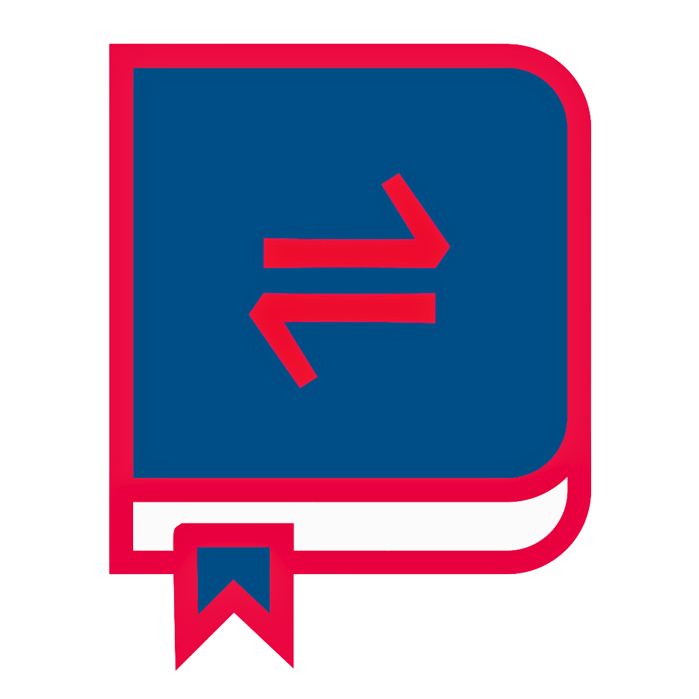

    
<h2 style="margin-right: 10px;">Mesort</h2>
    

MeSort is a research app designed to facilitate sorting tasks, especially during qualitative interviews. In the backend the researcher first defines the items to be sorted and the sorting scheme that should be used. Additional questions before and after the sorting process can also be defined.
The interview partner then sorts the items, the result of the sorting process gets saved and can be exported as pdf.

MeSort ist eine Forschungs-App, die entwickelt wurde, um Sortieraufgaben zu erleichtern, insbesondere bei qualitativen Interviews. Im Backend definiert der Forscher zunächst die zu sortierenden Elemente und das zu verwendende Sortierschema. Zusätzliche Fragen vor und nach dem Sortierprozess können ebenfalls definiert werden.
Der Interviewpartner sortiert dann die Items, das Ergebnis des Sortiervorgangs wird gespeichert und kann als pdf exportiert werden.

# Developer Notes

- MeSort started by using the "Study" nomenclature, that's why you can find it in routes, controllers and models. Just in 2022 we decided to shift to "Projects", to have the same nomenclature for all MeSoftware projects.
- This project official support will end on 01.12.2024. After that date, the project won't get any updates, but you can still contribute and we will review your PRs.
- The project was developed in a public GitLab repository, but we decided to move it to GitHub to have a better integration with other MeSoftware projects and a unified development environment.
